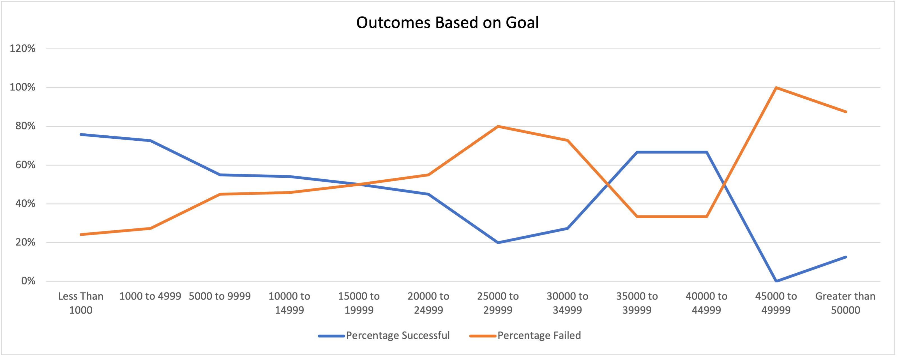
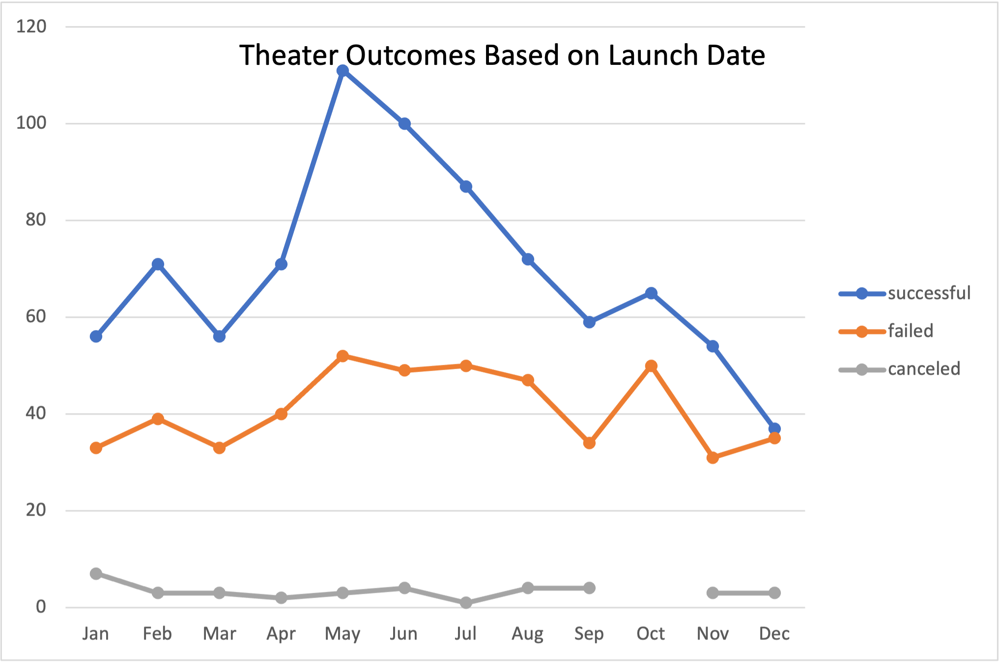

# Kickstarting with Excel

## Overview of Project

### Purpose
  Louise started a fundraising campagin for her play Fever. Louise was able to reach her goal sooner than she expected. Therefore she decided to look further into the trends of other fundraisers similar to hers. 
## Analysis and Challenges

### Analysis of Outcomes Based on Launch Date
   First form of analysis was the Outcomes Based on Launch Date. This set of Data shows the amount of fundraisers per outcome by month in which are in theater. 

### Analysis of Outcomes Based on Goals
   The second for of analysis was the Outcomes Based on Goals. This analysis counts how many fundraiswers had the outcome of either Successful, Failed and Canceled in certain ranges by Dollar amount. All data is based on the subcategory Plays.
   
### Challenges and Difficulties Encountered

## Results

- What are two conclusions you can draw about the Outcomes based on Launch Date?
   Two conclusions that I can gather from this analysis are that the trend for successful outcomes seem to be a bit left skewed based on the data. Therefore, you are more likely to reach your goal if you launch during May and June. Also I have noticed that if you are throwing a fundraiser under the theater category you have about a 61% success rate based on the data.  

- What can you conclude about the Outcomes based on Goals?
    For Outcomes Based on Goals, I can conclude that the lower the goal the more likely you are to succeed. The higher your goal the more likely you are to fail.
- What are some limitations of this dataset?
    Some limitations of this dataset is you do have some outliars with goals significantly higher than majority of the goals. This can show more failed outcomes. 
- What are some other possible tables and/or graphs that we could create?
    Some other possible tables and/or graphs I would make is to show the duration of the campaign by goal range for each outcome. This graph would show if there was a trend based on how long the campaign went for and by how much. I would also want to create averages for the campaign duration in days.
